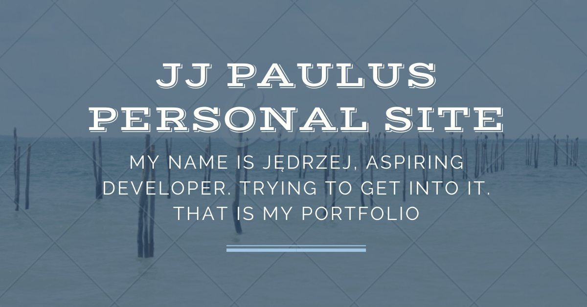

# JJ Paulus Personal Website

The website built with a great help of Maciek Korsan. The best frontend tutor I've ever met.

## Tools and technologies I've used.
 - Visual Studio Code
 - SASS
 - Fetch API
 - CSS Grid
 - HTML5
 - JavaScript

# Build with fun using wtf-gulp-starter

`npm install -g gulp-cli`

`npm install`

`gulp`

To publish your page using github pages use `npm run deploy`
